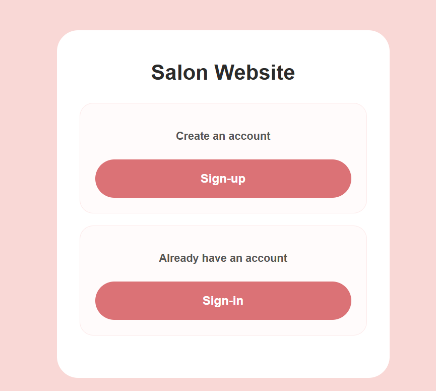

# Salon Website

## Overview 
This is a salon online booking website that allows user to explore salon services, book appointments , and manage their booking. the website is designed to provide simple and user-friendly experience.

## Features
- User registration and login
- View service details
- Select the service
- Book Appointments
- Edite the bookings
- Delete the bookings
- user reviews

## Future Improvements
- Email appointment reminders
- Online payment
- Dark mode

## Screenshots

## Technologies Used
- HTML
- CSS
- JavaScript
- Node.js
- EJS
- MongoDB
- Mongoose

## User Stories
- As customer I need to create an account so that I can book salon services
- As a customer I want to log in securely to access my account
- As a customer I want to browse avilable salon services so that I can choose the one I need
- As a customer I want to view a detailed information about each service, include the price and duration
- As a customer I want to book an appointment for select service
- As a customer I want to edit and delete the booking

## Getting Started
